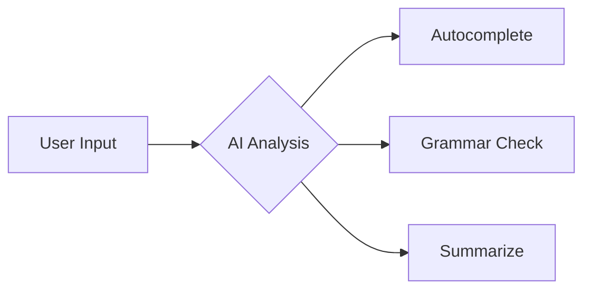
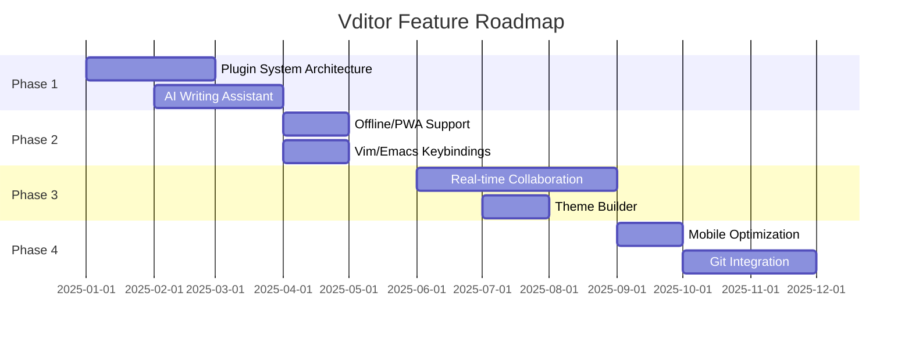

# Feature Suggestions for Vditor

Tài liệu này đề xuất các tính năng hữu ích để nâng cao trải nghiệm người dùng và mở rộng khả năng của Vditor.

## 1. AI Integration

### 1.1 AI Writing Assistant
- **Autocomplete**: Gợi ý hoàn thành câu/đoạn văn dựa trên context
- **Grammar & Spelling Check**: Kiểm tra ngữ pháp và chính tả đa ngôn ngữ
- **Text Summarization**: Tóm tắt nội dung dài
- **Translation**: Dịch nội dung sang ngôn ngữ khác

### 1.2 AI-Powered Features
- **Smart Formatting**: Tự động format code blocks, tables
- **Image Alt Text Generation**: Tự động sinh alt text cho hình ảnh
- **Diagram Suggestions**: Gợi ý diagram type phù hợp với nội dung



## 2. Real-time Collaboration

### 2.1 Multi-user Editing
- **Cursor Presence**: Hiển thị vị trí cursor của collaborators
- **Real-time Sync**: Đồng bộ nội dung theo thời gian thực (CRDT/OT)
- **User Avatars**: Hiển thị avatar người đang edit
- **Conflict Resolution**: Xử lý xung đột khi edit cùng vị trí

### 2.2 Collaboration Tools
- **Comments**: Thêm comments vào đoạn văn bản
- **Suggestions Mode**: Đề xuất thay đổi (như Google Docs)
- **Activity Log**: Lịch sử hoạt động của collaborators

## 3. Plugin System

### 3.1 Plugin Architecture
- **Plugin API**: API chuẩn để phát triển plugins
- **Plugin Marketplace**: Nơi chia sẻ và cài đặt plugins
- **Sandboxed Execution**: Chạy plugins trong môi trường isolated

### 3.2 Built-in Plugin Types
- **Custom Renderers**: Render custom syntax
- **Toolbar Extensions**: Thêm buttons vào toolbar
- **Keyboard Shortcuts**: Custom keybindings
- **Export Formats**: Thêm định dạng export mới

```typescript
// Plugin API concept
interface VditorPlugin {
  name: string;
  version: string;
  init(vditor: Vditor): void;
  destroy(): void;
  toolbar?: ToolbarItem[];
  renderers?: CustomRenderer[];
}
```

## 4. Enhanced Mobile Experience

### 4.1 Touch Optimization
- **Gesture Support**: Swipe, pinch-to-zoom
- **Mobile Toolbar**: Toolbar tối ưu cho touch
- **Voice Input**: Nhập liệu bằng giọng nói
- **Handwriting Recognition**: Nhận dạng chữ viết tay

### 4.2 Responsive Improvements
- **Adaptive Layout**: Layout thích ứng theo screen size
- **Bottom Sheet Menus**: Menus dạng bottom sheet cho mobile
- **Floating Action Button**: Quick actions button

## 5. Offline & PWA Support

### 5.1 Progressive Web App
- **Service Worker**: Cache assets và content
- **Offline Editing**: Edit khi không có mạng
- **Background Sync**: Đồng bộ khi có mạng trở lại
- **Push Notifications**: Thông báo collaboration updates

### 5.2 Local Storage
- **Auto-save Drafts**: Tự động lưu drafts locally
- **Version History**: Lưu lịch sử phiên bản local
- **Export Queue**: Queue exports khi offline

## 6. Advanced Export Options

### 6.1 New Export Formats
- **DOCX**: Export sang Microsoft Word
- **EPUB**: Export sang ebook format
- **LaTeX**: Export sang LaTeX source
- **Confluence/Jira Wiki**: Export cho Atlassian products
- **Notion**: Export compatible với Notion

### 6.2 Export Customization
- **Custom Templates**: Templates cho từng format
- **Style Presets**: Preset styles cho exports
- **Batch Export**: Export nhiều files cùng lúc

## 7. Version Control Integration

### 7.1 Built-in Versioning
- **Auto Snapshots**: Tự động tạo snapshots
- **Diff View**: So sánh versions
- **Restore Points**: Khôi phục về version cũ
- **Branch/Merge**: Branching cho documents

### 7.2 Git Integration
- **Git Commit**: Commit trực tiếp từ editor
- **GitHub/GitLab Sync**: Đồng bộ với remote repos
- **Pull Request Preview**: Preview markdown trong PRs

## 8. Enhanced Code Features

### 8.1 Code Editor Improvements
- **LSP Support**: Language Server Protocol cho code blocks
- **Code Execution**: Chạy code blocks (như Jupyter)
- **Snippet Library**: Thư viện snippets
- **Multi-cursor Editing**: Edit nhiều vị trí cùng lúc

### 8.2 Code Block Enhancements
- **Line Highlighting**: Highlight specific lines
- **Code Folding**: Thu gọn code blocks
- **Copy Button**: Nút copy cho code blocks
- **Diff Highlighting**: Highlight diff trong code

## 9. Keyboard & Accessibility

### 9.1 Advanced Keybindings
- **Vim Mode**: Full Vim keybindings support
- **Emacs Mode**: Emacs keybindings
- **Custom Keymap**: Tùy chỉnh keybindings
- **Command Palette**: Palette như VS Code (Ctrl+Shift+P)

### 9.2 Accessibility
- **Screen Reader Support**: Hỗ trợ screen readers
- **High Contrast Mode**: Chế độ high contrast
- **Keyboard Navigation**: Navigate hoàn toàn bằng keyboard
- **Focus Indicators**: Visual focus indicators

## 10. Theming & Customization

### 10.1 Theme Builder
- **Visual Theme Editor**: Tạo theme bằng UI
- **CSS Variables**: Expose CSS variables cho customization
- **Theme Presets**: Nhiều preset themes
- **Dark/Light Auto**: Tự động chuyển theo system preference

### 10.2 Editor Customization
- **Custom Fonts**: Chọn font cho editor
- **Line Spacing**: Tùy chỉnh line height
- **Margin/Padding**: Tùy chỉnh spacing
- **Focus Mode**: Highlight paragraph đang edit

## 11. Integration & Embedding

### 11.1 Third-party Integrations
- **Unsplash**: Insert images từ Unsplash
- **Giphy**: Insert GIFs
- **YouTube/Vimeo**: Embed videos
- **CodePen/JSFiddle**: Embed code demos
- **Figma**: Embed Figma designs

### 11.2 Embedding Options
- **oEmbed Support**: Auto-embed từ URLs
- **Custom Embed Handlers**: Register custom embed providers
- **Iframe Sandbox**: Secure iframe embedding

## 12. Performance Optimizations

### 12.1 Large Document Support
- **Virtual Scrolling**: Render visible content only
- **Lazy Loading**: Load content on demand
- **Web Workers**: Offload parsing to workers
- **Incremental Parsing**: Parse only changed content

### 12.2 Bundle Optimization
- **Tree Shaking**: Remove unused code
- **Dynamic Imports**: Load features on demand
- **CDN Optimization**: Optimize CDN delivery

## Priority Matrix

| Feature | Impact | Effort | Priority |
|---------|--------|--------|----------|
| Plugin System | High | High | P1 |
| AI Integration | High | Medium | P1 |
| Offline/PWA | Medium | Medium | P2 |
| Real-time Collaboration | High | High | P2 |
| Vim/Emacs Mode | Medium | Low | P2 |
| Theme Builder | Medium | Medium | P3 |
| Mobile Optimization | Medium | Medium | P3 |
| Git Integration | Medium | High | P3 |

## Implementation Roadmap



## Contributing

Nếu bạn muốn đóng góp vào việc phát triển các tính năng này:

1. Mở issue trên GitHub để thảo luận về feature
2. Fork repository và implement feature
3. Submit pull request với documentation đầy đủ
4. Tham gia review và feedback process
